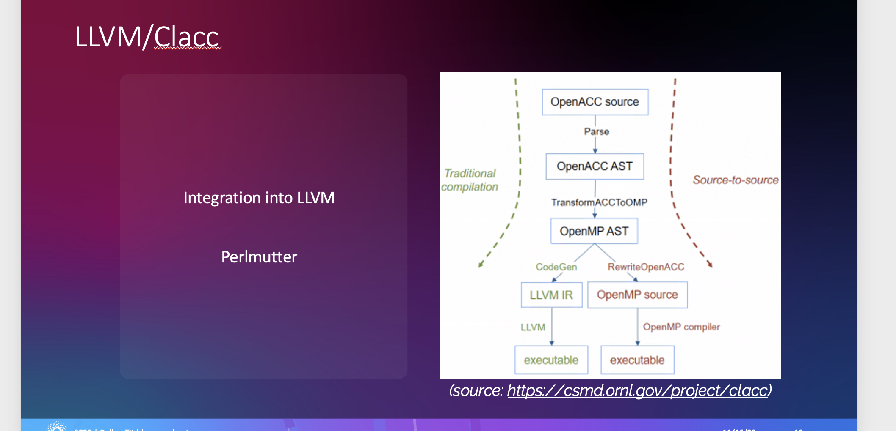

The primary goal of integration with [LLVM](https://llvm.org/) is to facilitate the use of the OpenACC V&V Suite for testing the behavior of Clacc’s
current and future OpenACC support [19].
We anticipate this testsuite project will immediately benefit
the development of Clacc (OpenACC support for C/C++ in
Clang) and Flacc (OpenACC support for Fortran in Flang).

These efforts would also be beneficial to establish feedback
from Clacc and Flacc to the OpenACC V&V testsuite team to
advance testing for the latest OpenACC specification versions
implemented in LLVM. Clacc and Flacc are developing their
own test suites that are to be contributed to upstream LLVM.
While the OpenACC V&V Suite can be used for validating all
OpenACC implementations, the Clacc and Flacc testsuites are
not meant to be that general. For example, Clacc’s test suites
exercise Clacc-specific command-line options and source-to-
source capabilities, which are beyond the scope of the Ope-
nACC specification. The major value of the OpenACC V&V
Suite would be an objective, third-party assessment of LLVM’s
(Clacc) conformance to the OpenACC specification that can
be compared with other OpenACC implementations. LLVM
has a testing infrastructure that contains regression tests and
a collection of whole programs [20], all of which are driven
by the LLVM Integrated Tester (LIT) tool. Clacc’s and Flacc’s
own test suites are being developed as extensions of LLVM’s
regression tests, which are small tests that are expected to
always pass and should be run before every commit. The
OpenACC V&V suite would be integrated into the collection
of whole programs.

**Implementation**
To set up an environment for the OpenACC validation and
verification suite entails a set of requirements that justify the
different features that we have implemented so far. These
requirements are as follows:
1) As mentioned in [21] the Clacc compiler translates
OpenACC to OpenMP in order to build upon the
OpenMP support being developed for Clang and LLVM.
To maximize reuse of the OpenMP implementation,
Clacc performs this translation early, on the abstract
syntax tree, which is the compiler front end’s internal
representation of the source code. This translation is
effectively a lowering of the representation and thus
follows the traditional ordering of compiler phases.
2) A CMakeList file has been created and included in this
project. It is a generator of build systems and used as
an entry point to our testsuite. It generates the Makefile
which allows users to compile, run, and report test
results. A set of make rules has been created for each
purpose, together with a set of options that modify each
rule’s behavior.
3) Those who would like to use this testsuite must be able
to obtain and export compilation and results. Hence,
the designed infrastructure should allow them to obtain
results in either a json format, or format for exporting
to other analysis tools and scripts.
Clacc is a project to develop OpenACC compiler and
runtime support for C and C++ in Clang and LLVM. Clacc’s
source code is available publicly on GitHub as part of the
LLVM DOE Fork maintained by ORNL. Clacc should be
built in the same manner as upstream LLVM when Clang and
OpenMP support are desired [21]. This integration includes a
CMakeLists for the OpenACC V&V suite so it can be built as part of the LLVM test-suite. The CMakeLists will search for
all C and C++ source files of the OpenACC V&V suite, and
compile and run them. Running llvm-lit (or ”make check”)
will require a compatible accelerator on the running machine.
