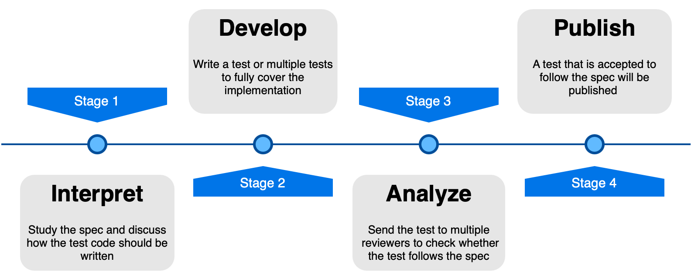

Although writing tests in a test suite is important, it is not the only factor that guarantees a successful test suite. It is necessary to find a workflow and an infrastructure that guarantees correctness. These should also open up the possibilities of discussion between different members of the project and the community, in order to reduce the chance of making mistakes while creating the tests.

One of the most challenging questions that validation and verification faces is: *How can we guarantee that the test we are using is valid?*. Although this non-trivial question does not have a single correct answer, we believe that the workflow we have been developing throughout our work is a good approach to guarantee that the tests we write and propose are as correct as possible.

Our current workflow can be seen in the following figure:

## Workflow explanation

Our tests are a make up of the most important features that we believe are testable. OpenACC has many features, from directives and their clauses to the runtime library and its extern functions, which are constantly being updated. For each feature we start by studying it and discussing it. We usually interact with compiler developers, parallel programmers, and all the members of our team to guarantee that our understanding of the particular feature is correct. After mapping out our understanding, a tests is formulated, initially to test our logic without implementing the feature then by adding the feature. This test goes through a development phase of running with various compilers. If the tests are not successful in running, concerns are raised and steps are taken to ensure where the fault lies, in the compiler, the logic, or the test code. This test is reviewed by multiple programmers for correctness and at this time any comments are made. Once a test is deemed valid, it is added to the list of tests in our testsuite.

Each tests can either *PASS* or *FAIL*. If it passes, no further action is performed during development, the test is then reviewed and added to our testsuite. But if it fails, it is open to our community one more time for a final discussion. If this discussion leads to the test being correct, we add it to the master branch (current release branch) of our repository to make it available to our final V & V testing suite. If it determined to be wrong, the comments and reason are gather and the tests goes back to development and the cycle starts again.

Sometimes testing of features is not possible given the available API and directives available to us. In such cases the logic of the test will determine a pass or fail, until the feature is available.
